# 🏡 Home Assistant Setup Guide

This repo has notes and useful links I've accumulated over time. Sharing for anyone wanting to get into [Home Assistant](https://www.home-assistant.io/)! Feel free to open an issue or submit a pull request with feedback or feature suggestions.

 ---

## 🚀 Getting Started  

### 🛒 Recommended Hardware  

| Item | Details | Price |  
|------|---------|-------|  
| [**Raspberry Pi 5 (8GB)**](https://www.amazon.com/dp/B0CK2FCG1K?ref=ppx_yo2ov_dt_b_fed_asin_title) | Latest model with better performance.<br>⚠️ If you get the Pi 5, active cooling is recommended.<br>Raspberry Pi 4 also works well if you want to save some money. | **~$80** |  
| [**Power Cord**](https://www.amazon.com/dp/B0CQ2DL2RW?ref=ppx_yo2ov_dt_b_fed_asin_title) | Reliable USB-C power supply.<br>Many options will work, but this is the one I use. | **~$10** |  
| **Micro SD Card** | Any standard Micro SD (16GB+ recommended).<br>Make sure to have an adapter to plug it into your computer if needed. | **~$10** |  
| [**Raspberry Pi 5 Case**](https://www.amazon.com/dp/B0CTBJ42P9?ref=ppx_yo2ov_dt_b_fed_asin_title) | Case with cooling fan (optional but recommended).<br>⚠️ The fans on this one are loud, but it's really cute! | **~$15** |  

**Total Estimated Cost:** ≈ **$115**

### 🏡 Architecture

The below is a basic representation of my Home Assitant setup. I have a router dedicated to devices that don't require internet access to keep as much activity private as possible. I also have Zwave set up and prefer that configuration to boost performance as new devices are added.

```mermaid
flowchart LR
    PWR([🔌 Power Cord])
    SD([💾 SD Card])
    ONET([🌐 Online Network Router])
    NET([🌐 Private Network Router])
    INET([🌐 Internet])
    ZW(["🛰️ Z-Wave USB Stick"])

    subgraph Case [🧰 Case]
        PI(["🍓 Raspberry Pi"])
    end

    subgraph Devices [💡 Connected Devices]
        Lights([💡 Smart Lights])
        Switches([🎚️ Smart Switches])
        Locks([🔐 Smart Locks])
        Garage([🚪 Garage Door])
        TV([📺 Smart TV])
        HVAC([🌡️ HVAC System])
        Smoke([🔥 Smoke Detectors])
        Plugs([🔌 Smart Plugs])
        Roomba([🧹 Roomba])
        CV([🚗 Connected Vehicle])
    end

    PWR --> PI
    SD --> PI
    PI <--> |Ethernet| ONET
    PI <--> |Wifi| NET
    PI <--> |USB| ZW
    ONET <--> |Cloudflare| INET

    ONET <--> TV
    ONET <--> Roomba
    ONET <--> CV
    ZW <--> HVAC

    NET <--> Lights
    NET <--> Switches
    ZW <--> Locks
    ONET <--> Garage
    ZW <--> Smoke
    NET <--> Plugs

    style PWR fill:#5a7de2,stroke:#fff,stroke-width:2px,color:#fff
    style SD fill:#5a7de2,stroke:#fff,stroke-width:2px,color:#fff
    style PI fill:#438dd5,stroke:#fff,stroke-width:2px,color:#fff
    style NET fill:#1168bd,stroke:#fff,stroke-width:2px,color:#fff
    style ZW fill:#3b82f6,stroke:#fff,stroke-width:2px,color:#fff

    classDef device fill:#60a5fa,stroke:#fff,stroke-width:2px,color:#fff
    class Lights,Switches,Locks,Garage,TV,HVAC,Smoke,Plugs,Roomba,CV device

    linkStyle default stroke:#fff,stroke-width:2px
```



---

## 🖥️ Install Home Assistant OS  
- Follow the official [installation guide](https://www.home-assistant.io/installation/raspberrypi/) for your Raspberry Pi model.  
- Complete the [onboarding steps](https://www.home-assistant.io/getting-started/onboarding/).  

---

## 🧰 Install HACS  
- First, download the [HACS app](https://www.hacs.xyz/docs/use/download/download/).  
- Then, add the HACS integration in Home Assistant:  
  - Go to **Settings** → **Devices & Services** → **Add Integration** → **HACS**.  

---

## 🏆 Add Cool Features  
- **Add-Ons** – Install the following popular add-ons from HACS:  
  - `Bubble Card`  
  - `browser_mod`  
  - `card-mod`  
  - `simpleicons`  

- **Devices & Integrations** – Go to **Settings** → **Devices & Services** and add your discovered devices!  

---

## 🌐 Remote Access with Cloudflare  
To securely access Home Assistant remotely without exposing your local network:  

1. Install the **Cloudflared Add-on** in Home Assistant:  
   - Go to **Settings** → **Add-ons** → **Add-on Store**  
   - Add the Cloudflared repository:  
     ``` 
     https://github.com/brenner-tobias/ha-addons 
     ```  
   - Install the **Cloudflared** add-on.  

2. Set up Cloudflare tunnel:  
   - Authenticate with Cloudflare to establish a secure tunnel.  
   - Set your desired hostname (e.g., `ha.yourdomain.com`).  

3. Update your `configuration.yaml`:  
    ```yaml
    http:
      use_x_forwarded_for: true
      trusted_proxies:
        - 172.30.33.0/24
    ```  

4. Restart Home Assistant.  

**🔹 Shoutout to [Cloudflare](https://www.cloudflare.com/) for offering this free and secure tunneling service!**  

[📺 Watch Setup Video](https://www.youtube.com/watch?v=JGAKzzOmvxg&utm_source=chatgpt.com)  

---

## 🎯 Next Steps  
✅ Set up automations  
✅ Explore more integrations  
✅ Customize your UI  
✅ Enjoy your smart home!  

---

### 🏆 **Need Help?**  
- Check out the official [Home Assistant documentation](https://www.home-assistant.io/docs/)  
- Visit the [Home Assistant Community](https://community.home-assistant.io/) for support  

---

> *Happy automating!* 😎
